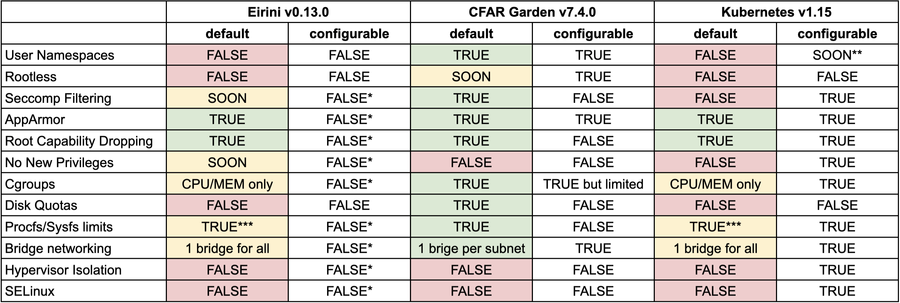

# Security Overview

The following table provides an overview of container security mechanisms across various container systems.
Table last updated 12/08/19. [Link to spreadsheet](https://docs.google.com/spreadsheets/d/1Rwg-C5B4yhyqUrKe_9ozhpiPKpo0Ck6RYBIKC0uzzvQ/edit?usp=sharing)

* \* Possible with [mutating webhooks](https://kubernetes.io/docs/reference/access-authn-authz/extensible-admission-controllers/#webhook-configuration)
* \*\* https://github.com/kubernetes/kubernetes/pull/64005
* \*\*\* Application is restarted after reaching the limit. The limit is configured globally for every application.
* \*\*\*\* Fewer masked paths than garden/docker (e.g. /proc/scsi)

* User Namespaces - False, not possible in Kubernetes yet
* Rootless - False, not possible in Kubernetes yet
* Seccomp - True, runtime default is applied
* AppArmor - True, runtime default is applied
* Root Capability Dropping - True, runtime default is applied
* No New Privileges - True, [`allowPrivilegeEscalation` is set to `false`](https://kubernetes.io/docs/tasks/configure-pod-container/security-context/)
* Cgroups - True if container processes' access to physical resources restricted by Cgroups
* Disk Quotas - True, using [ephemeral storage limits](https://kubernetes.io/docs/concepts/configuration/manage-compute-resources-container/#requests-and-limits-setting-for-local-ephemeral-storage).
* Procfs/Sysfs limits - True, runtime default is applied
* Bridge networking - Depends, see table for further info
* Hypervisor Isolation - True if Kubernetes is deployed [with this runtime](https://github.com/kubernetes/frakti)
* SELinux - False, can be [configured in the pod definition](https://kubernetes.io/docs/tasks/configure-pod-container/security-context/#assign-selinux-labels-to-a-container)

* Table inspired by: https://blog.jessfraz.com/post/containers-security-and-echo-chambers

## Environments

* Cloud Foundry Application Runtime v7.4.0 - Standard deployment on Xenial trusty stemcell
* Kubernetes v1.13.3 - Standard deployment on GCP
